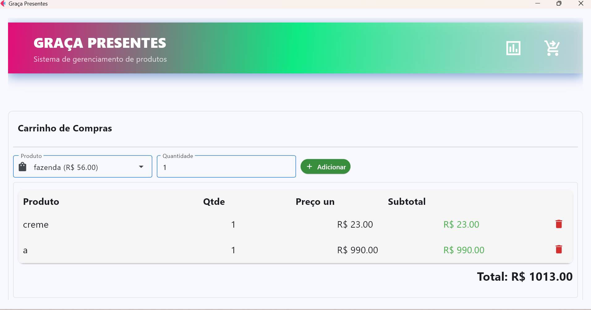
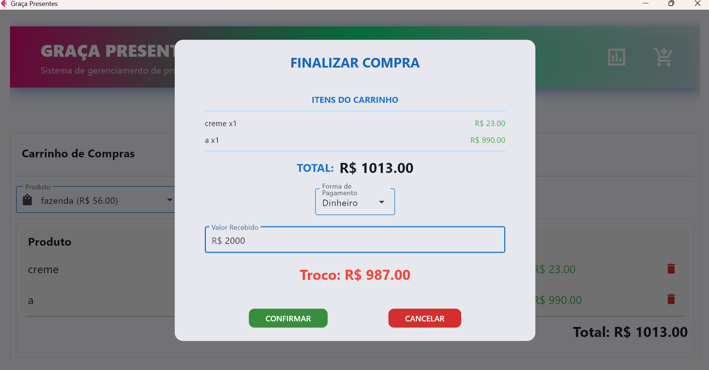
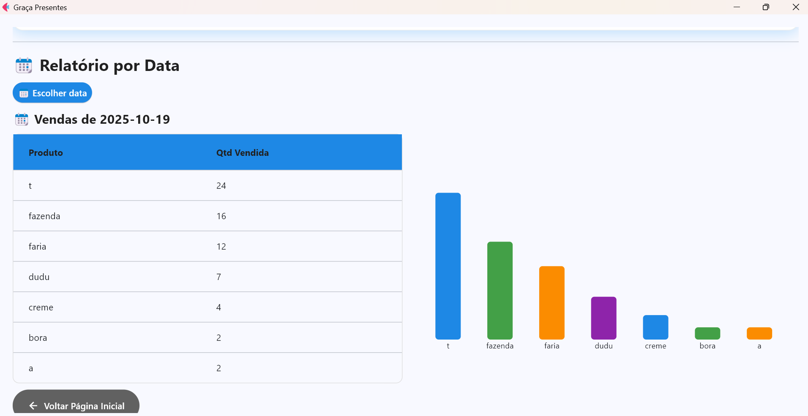
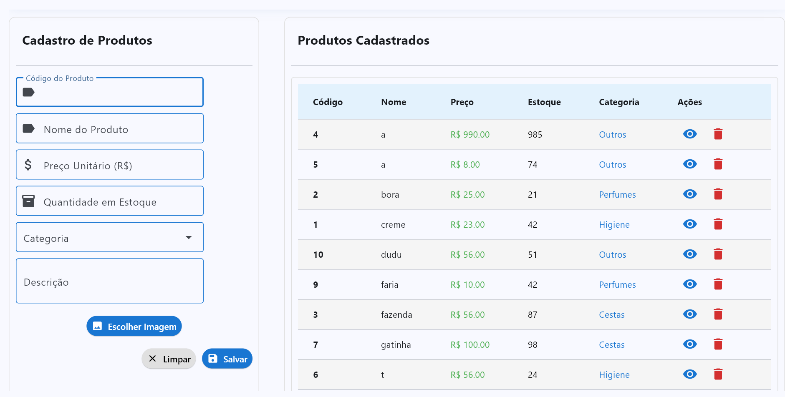

# Graça Presentes - Sistema PDV & Gestão de Estoque 🎁


O **Graça Presentes** é uma solução completa de Ponto de Venda (PDV) e controle de inventário voltada para o varejo. Desenvolvido com uma interface moderna e responsiva (estilo mobile-first para desktop), o sistema foca em usabilidade, agilidade no atendimento e inteligência de dados.

## 📸 Demonstração Visual

<div align="center">
  <table>
    <tr>
      <td align="center"><b>Dashboard Analítico</b><br></td>
      <td align="center"><b>Frente de Caixa (PDV)</b><br></td>
    </tr>
    <tr>
      <td align="center"><b>Gestão de Inventário</b><br></td>
      <td align="center"><b>Comprovantes & QR Code</b><br></td>
    </tr>
  </table>
</div>

---

## 🚀 Funcionalidades Principais

### 🛒 Frente de Caixa (PDV)

- **Carrinho Dinâmico:** Adição rápida de itens com cálculo em tempo real de subtotais e totais.
- **Multi-Pagamento:** Suporte para Dinheiro (com cálculo de troco), PIX e Cartão.
- **Gestão de Cartões:** Fluxo detalhado para vendas no crédito/débito, incluindo nome do cliente e parcelamento.
- **Emissão de Comprovantes:**
  - Geração de recibos em formato `.txt`.
  - **Integração com WhatsApp:** Envio direto do comprovante para o cliente.
  - **QR Code:** Geração dinâmica para compartilhamento rápido na tela.

### 📊 Business Intelligence & Dashboards

- **Analytics em Tempo Real:** Visualização de Total Vendido, Volume de Vendas e Ticket Médio.
- **Gráficos Interativos:**
  - **Evolução de Vendas:** Gráficos de linha por forma de pagamento.
  - **Top Produtos:** Ranking dos itens mais vendidos.
  - **Saúde do Estoque:** Monitoramento visual de níveis críticos de produtos.
- **Filtros Históricos:** Consulta detalhada de vendas por datas específicas.

### 📦 Gestão de Inventário

- **Cadastro Rico:** Controle de produtos com fotos, códigos únicos, categorias e descrições detalhadas.
- **Busca Inteligente:** Localização ágil de itens por código ou nome com preview de imagem.
- **Movimentação Automatizada:** Baixa automática de estoque no momento da venda e reposição em caso de cancelamento.

---

## 🛠️ Diferenciais Técnicos

- **Persistência Robusta:** Utilização de **SQLite** com relacionamentos entre tabelas (Vendas, Itens, Dados de Cartão).
- **Arquitetura Escalável:** Divisão clara entre lógica de interface (`app.py`), banco de dados (`database.py`) e componentes de relatórios (`relatorio.py`).
- **Portable Ready:** Sistema preparado para ser compilado como executável (`.exe`), com tratamento automático de caminhos de arquivos e pastas de banco de dados.
- **Sistema de Logs:** Implementação de logging para rastreamento de erros e debug em ambiente de produção.
- **Segurança de Mídia:** Armazenamento local padronizado de imagens de produtos para garantir integridade visual.

---

## 📂 Estrutura do Projeto

- `app.py`: Core da aplicação, gerenciamento de estados e interface Flet.
- `database.py`: Camada de acesso a dados (DAO) e configurações do SQLite.
- `relatorio.py`: Lógica de processamento de dados com Pandas e geração de gráficos.
- `imagens_produtos/`: Diretório gerenciado pelo sistema para armazenamento de fotos.
- `assets/`: Recursos visuais e capturas de tela para documentação.

---

## ⚙️ Instalação e Execução (Desenvolvimento)

1. **Clone o repositório**

```bash
git clone https://github.com/seu-usuario/graca-presentes.git
cd pacoteflet
```

2. **Instale as dependências**

```bash
pip install flet pandas qrcode pillow
```

3. **Execute o sistema**

```bash
python app.py
```

---

## 📦 Geração de Executável

Para gerar o arquivo `.exe` para Windows:

1. `pip install pyinstaller`
2. `pyinstaller graca.spec`
3. O resultado estará na pasta `dist/`.
